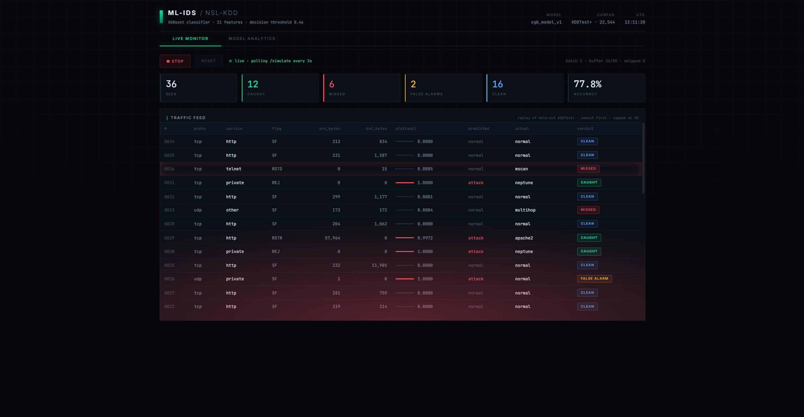
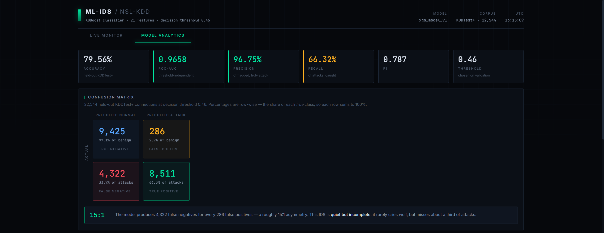
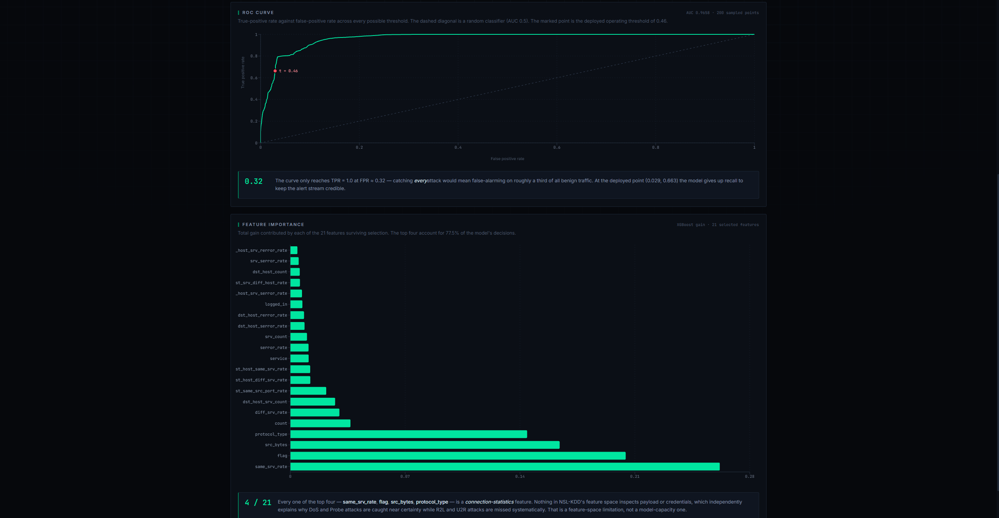

# ML-IDS — Machine Learning Intrusion Detection System

A supervised intrusion-detection classifier trained on NSL-KDD, served through a FastAPI backend, with a React dashboard that replays held-out test traffic in real time and visualises the model's behaviour.

Built as an academic project with an explicit constraint: **report the honest number, not the flattering one.** The two most interesting findings below are both limitations.

---

## Live demo

- **Dashboard:** https://ml-ids-kappa.vercel.app
- **API:** https://ml-ids.onrender.com · [`/docs`](https://ml-ids.onrender.com/docs)

Frontend on Vercel (static Vite build), backend on Render (FastAPI, free tier). The API instance spins down after ~15 minutes of inactivity, so the first request after idle takes ~40 seconds to wake the container — subsequent requests are instant. Hit `/analytics` once to warm it before demoing.

---

## Screenshots

## Screenshots

**Live Monitor** — replays held-out KDDTest+ connections through the real inference pipeline, colour-coded by confusion-matrix outcome.



**Model Analytics** — metrics, confusion matrix, and feature importances served from a precomputed evaluation.



**ROC curve** — the marked point is the deployed operating threshold.



---

## Results

Evaluated once on the held-out KDDTest+ set (22,544 connections) at a threshold selected on a validation split.

| Metric | Value |
|---|---|
| Accuracy | **79.56%** |
| ROC-AUC | **0.9658** |
| Precision (attack) | 96.75% |
| Recall (attack) | 66.32% |
| F1 (attack) | 0.787 |
| Decision threshold | 0.46 |

Confusion matrix:

|  | Predicted normal | Predicted attack |
|---|---|---|
| **Actual normal** | 9,425 | 286 |
| **Actual attack** | 4,322 | 8,511 |

Model progression:

| Stage | Accuracy | Status |
|---|---|---|
| Random Forest baseline | 77.70% | Valid |
| Random Forest tuned, threshold 0.32 | 81.87% | **Invalid — see below** |
| XGBoost, honest evaluation | 79.56% | Deployed |

---

## Finding 1 — the 81.87% was test-set leakage

The tuned Random Forest reached 81.87% by sweeping decision thresholds directly against `KDDTest+` and keeping whichever scored best. That is model selection on the test set: the reported accuracy is no longer an estimate of unseen performance, because the test set influenced the choice.

The tell was that optimal thresholds kept drifting downward across runs — 0.20, then 0.16, then 0.06. A threshold that low isn't a decision boundary, it's the search fitting noise in a specific 22,544-row sample.

The fix was to carve a 20% validation split out of the training data, select the threshold there (0.46), and evaluate on test exactly once. Accuracy dropped to 79.56%. That drop is the point: the earlier number was measuring the wrong thing.

Both runs are preserved in the notebooks (`notebooks/01` cells 12–14 for the original, `notebooks/02` cells 13–17 for the correction) rather than quietly deleted.

## Finding 2 — recall is capped by the feature space, not the model

The 15:1 ratio of false negatives to false positives means this IDS is **quiet but incomplete**: it rarely raises a false alarm, but misses about a third of attacks. Those misses are not borderline cases.

Sampled misses and their attack probabilities:

| Attack | p(attack) | Category |
|---|---|---|
| `guess_passwd` | 0.0001 | R2L |
| `snmpguess` | 0.0064 | R2L |
| `mscan` | 0.0077 | Probe (absent from KDDTrain+) |
| `warezmaster` | 0.0094 | R2L |

A `warezmaster` FTP session scored 0.0094 — the model was 99% confident it was benign. It is right to be, given what it can see: statistically, that session is indistinguishable from legitimate FTP.

NSL-KDD's 41 features describe connection *statistics* — durations, byte counts, error rates, service distributions. The four highest-gain features in the trained model (`same_srv_rate`, `flag`, `src_bytes`, `protocol_type`) are all statistical, together accounting for ~77% of total gain. Nothing in the feature space inspects payload, credentials, or file content.

DoS and Probe attacks distort traffic statistics and are caught at near-certainty. R2L and U2R attacks abuse credentials and are invisible **by construction of the dataset**. Improving recall here requires different features — payload inspection, authentication logs — not a larger model or more tuning.

---

## Pipeline

Preprocessing order is fixed and identical in training and serving:

```
raw connection (41 features)
  → encoders.pkl          label-encode protocol_type, service, flag
  → scaler.pkl            min-max scale to [0, 1]
  → feature_selector.pkl  SelectFromModel, 41 → 21 features
  → xgb_model_v1.pkl      XGBoost, 300 trees, max_depth 8
  → threshold 0.46        probability → attack / normal
```

`/simulate` reuses the same `preprocess()` function as `/predict` by constructing `Connection` objects, rather than reimplementing the pipeline — so the demo cannot drift from production behaviour.

### API

| Endpoint | Purpose |
|---|---|
| `GET /simulate?n=N` | Replay N random held-out test rows; returns prediction, probability, true label, attack type |
| `GET /analytics` | Precomputed ROC points, confusion matrix, feature importances |
| `POST /predict` | Single-connection prediction |

---

## Running it

Requires Python 3.12+ and Node 20+.

```bash
git clone https://github.com/krishazad07-commits/ml-ids.git
cd ml-ids
```

**Terminal 1 — API on :8000**

```bash
python -m venv venv
venv\Scripts\activate          # Windows
# source venv/bin/activate     # macOS / Linux
pip install -r requirements.txt
uvicorn app:app --reload
```

**Terminal 2 — dashboard on :5173**

```bash
cd frontend
npm install
npm run dev
```

Open http://localhost:5173. Both servers must be running — the dashboard has no data of its own.

Trained artifacts are committed, so no training step is required. To reproduce them from scratch, install `requirements-dev.txt` and run the notebooks in order.

Interactive API docs: http://localhost:8000/docs

---

## Repository

```
ml-ids/
├── app.py                    FastAPI server — loads artifacts once at startup
├── generate_analytics.py     Precomputes analytics.json
├── verify_setup.py           Environment check
├── data/                     NSL-KDD KDDTrain+ / KDDTest+
├── models/                   Trained artifacts (committed)
├── notebooks/
│   ├── 01_baseline_and_feature_selection.ipynb
│   └── 02_xgboost_honest_evaluation.ipynb
├── frontend/                 React + Vite dashboard
└── docs/                     Screenshots
```

---

## Known limitations

- **Recall of 66%** — structural, discussed above. Not fixable within NSL-KDD's feature space.
- **Simulated traffic, not live capture.** The Live Monitor replays held-out test rows rather than capturing packets. Real capture would require packet parsing and feature derivation over time windows — a separate project.
- **Dataset age.** NSL-KDD derives from 1999 traffic. It remains a standard benchmark but does not reflect modern protocols or attack patterns.
- **`SelectFromModel` warning on every request.** The selector was fitted on a NumPy array and predicts on a DataFrame, so scikit-learn warns about feature names. Column order is enforced by construction in `preprocess()` and metrics reproduce the training run to four decimal places. Cosmetic.
- **Artifacts in version control.** Trained models are committed so the project runs on clone. In production these belong in a model registry — binary artifacts don't diff, and models are retrained on a different cadence from code.
- **Live-monitor recall reads low over short runs** (~56% vs the true 66%) — sampling noise at small n. It converges over several minutes.

---

## Stack

Python · FastAPI · XGBoost · scikit-learn · pandas · React · Vite · Recharts

Dataset: [NSL-KDD](https://www.unb.ca/cic/datasets/nsl.html), Canadian Institute for Cybersecurity, University of New Brunswick.
